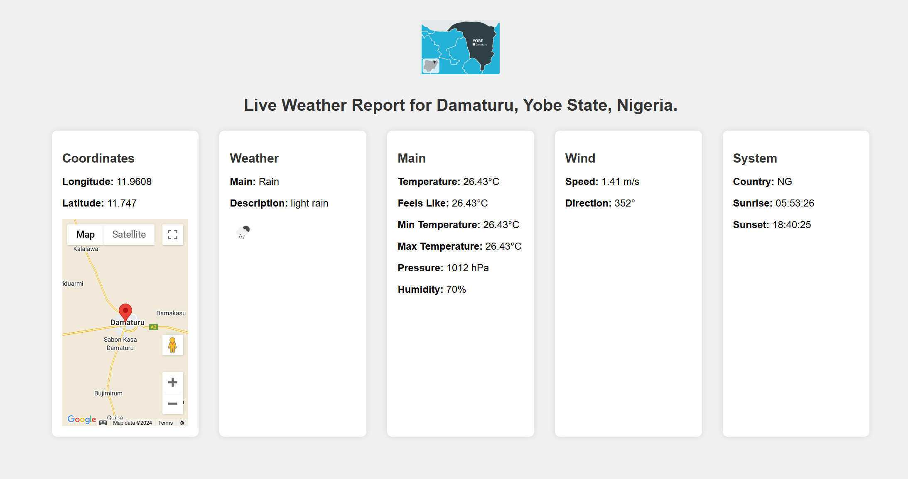

# Live Weather Report for Damaturu, Yobe State, Nigeria.

## Project Description

This project is a live weather report monitoring web application for Damaturu, Yobe State. The application fetches real-time weather data from the OpenWeatherMap API and displays it on a web page using Flask, a lightweight WSGI web application framework in Python. The displayed weather data includes temperature, humidity, wind speed, and other essential weather information along with a map showing the location.

## Technologies and Framework Used

- **Python**: The core programming language used to build the backend of the web application.
- **Flask**: A micro web framework for Python used to serve the web pages and API endpoints.
- **HTML/CSS**: For structuring and styling the web page.
- **JavaScript**: Used for fetching data from the Flask API and rendering it dynamically on the web page.
- **Google Maps API**: For displaying the map with the location coordinates of Damaturu.
- **OpenWeatherMap API**: Used to fetch real-time weather data for Damaturu.

## Getting Started

### Prerequisites

To run this project, you need to have the following installed on your local machine:

- Python 3.6 or higher
- pip (Python package installer)

### Installation

1. **Clone the repository:**

    ```sh
    git clone https://github.com/your-username/sensor-data-monitor.git
    cd sensor-data-monitor
    ```

2. **Install the required Python packages:**

    ```sh
    pip install -r requirements.txt
    ```

3. **Set up the configuration file:**

    Create a file named `config.py` in the project directory and add your API keys:

    ```python
    # config.py
    API_KEY = 'YOUR_GOOGLE_MAPS_API_KEY'  # Replace with your actual Google Maps API key
    OPENWEATHERMAP_API_KEY = 'YOUR_OPENWEATHERMAP_API_KEY'  # Replace with your OpenWeatherMap API key
    ```

4. **Run the Flask app:**

    ```sh
    python app.py
    ```

### Navigating the Project

- **app.py**: The main Flask application file that sets up the server and routes.
- **config.py**: Configuration file containing the API keys.
- **templates/index.html**: The HTML file that serves as the front end of the application.
- **screenshot.png**: Screenshot of the web page.

### Usage

1. **Start the Flask server** by running `python app.py`.
2. **Open your web browser** and navigate to `http://127.0.0.1:5000/index.html` to view the live weather report for Damaturu, Yobe State.

## Features

- **Real-time Weather Data**: Fetches and displays up-to-date weather information.
- **Interactive Map**: Shows the geographical location of Damaturu using Google Maps.
- **Responsive Design**: The web page is designed to be responsive and works well on different screen sizes.

## Screenshot



## License


---

© 2024 [Abdullahi Isa Ahmed](https://abdullahiisaahmed.com/)

- [GitHub Repository](https://github.com/Abdullah2020)
